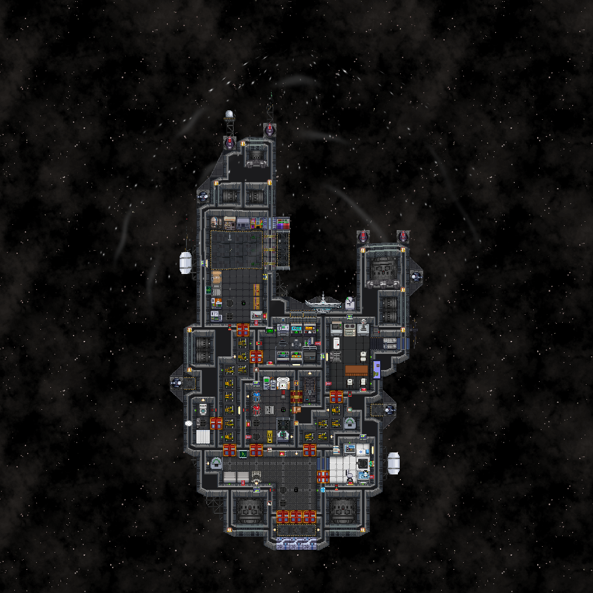

# FTL effects

A rounded cone of clear distortion, wider than the hull, encloses the forward half of a ship and ends at midship.
Its elliptical nose sits just ahead of the bow, with a clearance of 0.75 to 6 metres depending on hull width.
There is no colored outline or tint. Curved pressure waves refract the scene, with two layers of compact white
sparks flowing toward midship. A compact white flash punctuates the jump. It builds during the last four seconds
of spool-up, flashes on departure and arrival, and fades over 0.65 seconds. There are no new controls.

The server `FtlDepartureSystem` mirrors the existing FTL clock into `FtlDepartureComponent`, without changing
travel, docking or sounds. The client `FtlDepartureOverlay` draws the smooth field through `WFFtlDeparture`.
Local north is forward, matching the upstream departure thrusters. Separate docked grids do not enlarge the
lead ship's cone. Cancellation removes the effect; late observers use the same networked clock.

Outside observers see a 0.24-second accelerating launch and a rapid braking arrival. `FtlMotionOverlay`
reprojects the already-rendered hull over the space saved by `FtlMotionBackgroundOverlay`; it never changes
entity transforms or collision bodies. Its mask covers occupied tiles and their wall sprites, preserving gaps between wings.
This only reproduces hull pixels present in the viewport; it cannot invent an offscreen portion of the ship.
The saved space is an exact, unlit copy (`WFFtlCopy`): lighting is live while the layers below the world draw,
so a default-shader copy comes out dimmed by the light map and shows as a dark patch where the hull was.
Crew aboard keep a steady camera and see the cone. The shader bends scene pixels throughout the cone.

Grids are not predicted, so the client times every effect on the server state it is showing
(`FtlDepartureSystem.Now`), not its predicted clock, which runs a few ticks ahead. The jump lands on the first
tick after the scheduled time, so a launched hull stays painted over with the saved background until its grid
leaves the map (`FtlDepartureTiming.Gone`, capped at one second).

Grids docked to the jumping ship get the same component with `Lead` set. They rush, hide and arrive in the lead
ship's frame and get no cone of their own; crew anywhere in the convoy keep a steady camera.

Only a ship's grid is always known to every client; its contents enter view at the PVS entity budget. During
the arrival countdown the server therefore adds PVS session overrides for the convoy to players within 48 metres
of the hull's reach at the destination, so the whole ship is on their client before it drops out. The overrides
stay within the entity budget and are removed on arrival.

Existing upstream arrival tiles and hyperspace parallax remain in place. No upstream hooks or engine edits
are needed. `FtlConeGeometryTest`, `FtlDepartureTimingTest` and `FtlDepartureTest` cover the shape, rush and lifecycle.

<!-- WOLFGATE-GENERATED START -->
<!-- Generated by python Tools/_WF/Ci/modules.py --write. Don't edit by hand. -->

## Files

### Server

- [`Content.Server/_WF/FtlEffects/FtlDepartureSystem.cs`](FtlDepartureSystem.cs)

### Shared

- [`Content.Shared/_WF/FtlEffects/FtlDepartureComponent.cs`](../../../Content.Shared/_WF/FtlEffects/FtlDepartureComponent.cs)
- [`Content.Shared/_WF/FtlEffects/FtlDepartureTiming.cs`](../../../Content.Shared/_WF/FtlEffects/FtlDepartureTiming.cs)

### Client

- [`Content.Client/_WF/FtlEffects/FtlConeGeometry.cs`](../../../Content.Client/_WF/FtlEffects/FtlConeGeometry.cs)
- [`Content.Client/_WF/FtlEffects/FtlDepartureOverlay.cs`](../../../Content.Client/_WF/FtlEffects/FtlDepartureOverlay.cs)
- [`Content.Client/_WF/FtlEffects/FtlDepartureSystem.cs`](../../../Content.Client/_WF/FtlEffects/FtlDepartureSystem.cs)
- [`Content.Client/_WF/FtlEffects/FtlMotionBackgroundOverlay.cs`](../../../Content.Client/_WF/FtlEffects/FtlMotionBackgroundOverlay.cs)
- [`Content.Client/_WF/FtlEffects/FtlMotionOverlay.cs`](../../../Content.Client/_WF/FtlEffects/FtlMotionOverlay.cs)

### Integration tests

- [`Content.IntegrationTests/Tests/_WF/FtlEffects/FtlDepartureTest.cs`](../../../Content.IntegrationTests/Tests/_WF/FtlEffects/FtlDepartureTest.cs)

### Unit tests

- [`Content.Tests/_WF/FtlEffects/FtlConeGeometryTest.cs`](../../../Content.Tests/_WF/FtlEffects/FtlConeGeometryTest.cs)
- [`Content.Tests/_WF/FtlEffects/FtlDepartureTimingTest.cs`](../../../Content.Tests/_WF/FtlEffects/FtlDepartureTimingTest.cs)

### Prototypes

- [`Resources/Prototypes/_WF/FtlEffects/shaders.yml`](../../../Resources/Prototypes/_WF/FtlEffects/shaders.yml)

### Textures

- [`Resources/Textures/_WF/FtlEffects/Shaders/ftl_background.swsl`](../../../Resources/Textures/_WF/FtlEffects/Shaders/ftl_background.swsl)
- [`Resources/Textures/_WF/FtlEffects/Shaders/ftl_copy.swsl`](../../../Resources/Textures/_WF/FtlEffects/Shaders/ftl_copy.swsl)
- [`Resources/Textures/_WF/FtlEffects/Shaders/ftl_departure.swsl`](../../../Resources/Textures/_WF/FtlEffects/Shaders/ftl_departure.swsl)
- [`Resources/Textures/_WF/FtlEffects/Shaders/ftl_motion.swsl`](../../../Resources/Textures/_WF/FtlEffects/Shaders/ftl_motion.swsl)

### Docs

- [`Docs/_WF/FtlEffects/preview.png`](../../../Docs/_WF/FtlEffects/preview.png)

## Non-modular edits

None.

<!-- WOLFGATE-GENERATED END -->
